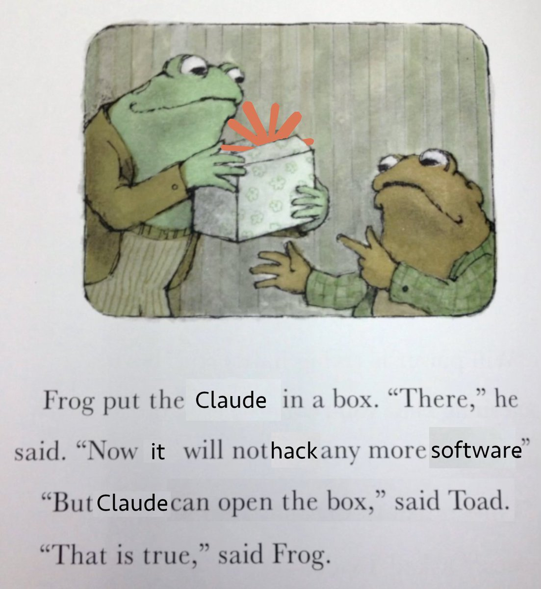

# Security Model

Asylum is a **blast-radius containment tool** for AI coding agents running in YOLO mode. It narrows the surface area an agent can accidentally damage on your machine. It is **not** a security sandbox: it does not try to contain adversarial code, and a determined attacker with code execution inside the container has many paths out.

Think of it as a seatbelt, not an airbag. It turns "the agent wiped my home directory" into "the agent wiped this one project" — and it stops there.

## What Asylum Protects Against

- **Accidental destruction outside the project.** Only your project directory, a handful of config files, and named caches are mounted. An agent running `rm -rf ~` inside the container cannot touch the rest of your home directory.
- **Host system pollution.** System packages, PATH changes, services, and global installs land inside the container and disappear when it's removed. Your host stays clean.
- **Cross-project damage.** Each project gets its own container, its own image, and its own port range. An agent working on project A cannot reach project B's files or running services.
- **Unrelated credentials.** Your host dotfiles, browser profiles, password manager databases, cloud CLI tokens (`~/.aws`, `~/.config/gcloud`, etc.) are not mounted by default. An agent cannot read them.

## What Asylum Does NOT Protect Against

### Your project directory

The project is mounted read-write at its real host path. An agent can delete, rewrite, or corrupt any file in it. **Commit often and push branches regularly** — your git history is the only safety net for your own code.

### Your git identity and SSH keys

- `~/.gitconfig` is mounted read-only, so commits are attributed to you.
- The SSH kit mounts a private key into `~/.ssh/` (a key Asylum generated, or your host key in `shared` mode). An agent can use it to push to any repository that trusts it, or to SSH into any host that does.

An agent can make commits and push code as you. Treat anything the agent touches as if you wrote it yourself.

### Credentials inside the agent config

Agent config is either seeded from your host (`isolated`/`project` modes) or mounted directly (`shared`). Either way, API keys, MCP server tokens, and session data inside the container are real credentials. An agent can read them and use them.

### Network access

Containers have unrestricted outbound network. An agent can call any API, upload any file it can read, or pull in arbitrary code from the internet. Asylum does not firewall or proxy traffic.

### The host machine

- `host.docker.internal` resolves to your host from inside the container. Services listening on the host (databases, dev servers, SSH agents, etc.) are reachable.
- [Forwarded ports](../kits/ports.md) expose container services on your host's network interface. Anyone who can reach your host can reach those services.
- The [Docker kit](../kits/docker.md) runs the container in **privileged mode** with a full Docker daemon. Privileged mode grants effectively full access to the host kernel. This is a deliberate trade-off for Docker-in-Docker; enable it only when you need it.

### Malicious or compromised code

Docker is a convenience boundary, not a security boundary against untrusted code. Container escapes exist, privileged mode removes most remaining isolation, and the attack surface (mounted sockets, the agent's network access, your SSH key) is large. **Do not run code you actively distrust inside Asylum and expect the container to contain it.**

### Opt-in bypass modes

Several options deliberately reduce isolation. If you enable them, you accept the trade-off:

- `agents.<name>.config: shared` mounts your host `~/.claude` (or equivalent) read-write.
- `kits.ssh.isolation: shared` mounts your entire host `~/.ssh` read-write, including every key you own.
- `kits.docker` enables privileged mode (see above).
- Custom `volumes:` entries mount whatever you tell them to mount, with whatever permissions you specify.

### The Asylum binary itself

`asylum` runs as your user on the host and talks to the Docker daemon. Docker daemon access is generally equivalent to root on the host. Asylum does not sandbox itself, and the host must be trusted.

## Practical Guidance

- Keep the project directory under version control and push branches often.
- Rotate any credential you think an agent may have exfiltrated — this includes the SSH key in `~/.asylum/ssh/` and anything in your agent config.
- Prefer `isolated` or `project` config modes over `shared`.
- Only enable the Docker kit on projects that actually need Docker-in-Docker.
- Do not use Asylum to review or execute code you have specific reason to distrust. Use a disposable VM instead.
